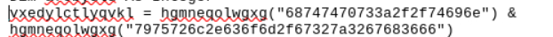

We’ve got strings pulled from a VBA script, so the next step is to decode them and figure out what the script is actually doing. The goal here is to break down the obfuscation and see what real commands or IOCs are hiding behind it.

First let’s break down this block. I’m only focusing on the hex strings here since the rest of the functions are just junk code meant to distract.

The & in the code is just being used for string concatenation, stitching smaller parts together to form the full payload.

From decoding the script, we end up with a domain paired with a suspicious directory. That’s usually the key indicator that the macro is reaching out to pull a payload or connect to C2.

Now we move on to the next block. Same approach ,focus on the encoded strings and leave the filler functions aside. The goal is to pull out any more useful indicators like domains, file names, or commands that might tie back to earlier activity.

The very next line in the code points to Environ("Temp")/ and ties back to the same function that dropped the executable earlier. This means the macro is staging its payload in the Temp directory, which is common for malware to hide execution. From the tinyurl reference all the way down to this Temp path, everything looks connected ,it’s one chain leading to the dropped .exe

From this line I can deduce that the URL is being used to create a temp file named dropped.exe. The chain is clear the macro pulls from the tinyurl, stages it in the Temp directory, and writes it out as the dropped executable. Let’s move forward from here.

This confirms that something is definitely being created , the macro isn’t just obfuscation, it’s writing out a file. Between the URL reference and the Temp path, the behavior clearly points to dropping an executable on the system..

The script is using a COM object. COM, or Component Object Model, is basically a built-in Windows feature where different components can be called by scripts to do specific jobs. You don’t need to install them, they’re already there.

Here the object is MSXML2.ServerXMLHTTP.6.0, part of Microsoft’s XML Core Services. It lets scripts make HTTP requests directly, acting like a browser but without the window. The .6.0 just marks the version. Malware uses this a lot because it avoids shipping a downloader — they can fake headers, look like Internet Explorer, and still fetch files over HTTPS.

The typical flow is straightforward. The macro calls CreateObject("MSXML2.ServerXMLHTTP.6.0"), opens a connection to the URL, sends the request, and gets the response bytes with http.ResponseBody. Those bytes then get handed to another COM object, ADODB.Stream, which writes them to disk as something like dropped.exe. Finally, Wscript.Shell or Shell gets called to execute the file.

This whole setup matters because by chaining MSXML2.ServerXMLHTTP with ADODB.Stream, the macro downloads and runs a payload without carrying extra tools. It’s all native Windows functionality being abused.

The string you’ve spotted is the User-Agent field. It’s almost certainly fake ,malware authors often spoof old Internet Explorer or Windows versions to make the traffic look legitimate or to bypass weak filters on the server side. It can also be used as a cheap form of “authentication,” where the attacker’s server only responds to requests with the exact fake User-Age

All straightforward as we decoded the meaning earlier .

{

Now we are analyzing the later part of the code .

The script is using two important pieces here: WScript.Shell and winmgmts:\\\\.\\root\\cimv2:Win32_Process.

WScript.Shell is a COM object that lets the macro run commands, launch executables, and interact with the Windows shell. This is usually how malware executes the final payload—in this case, the dropped executable from earlier.

winmgmts:\\\\.\\root\\cimv2:Win32_Process is WMI, Windows Management Instrumentation. The root\cimv2 namespace and Win32_Process class together allow the script to spawn new processes. Instead of calling cmd.exe directly, the macro uses WMI as a stealthier way to start the payload.

Malware uses WMI here for a few reasons: it’s stealthier than cmd.exe, can bypass some restrictions by running processes under different contexts, and is often abused for persistence or lateral movement.

Putting it all together, the macro uses MSXML2.ServerXMLHTTP.6.0 to download the malicious file, ADODB.Stream to save it as dropped.exe, and finally either WScript.Shell or WMI’s Win32_Process to execute the file quietly.

