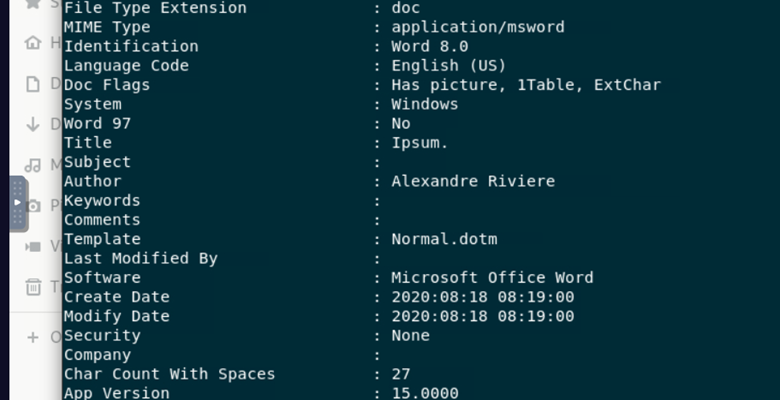
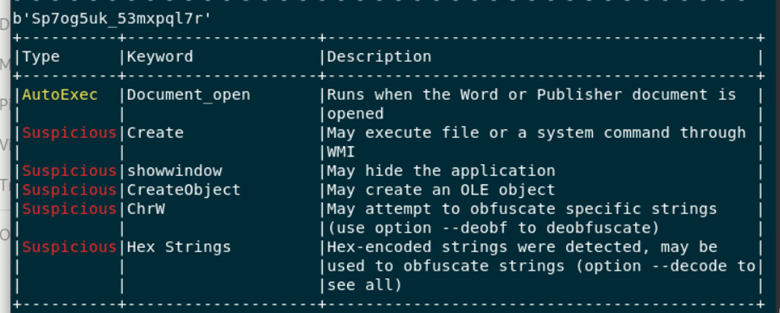
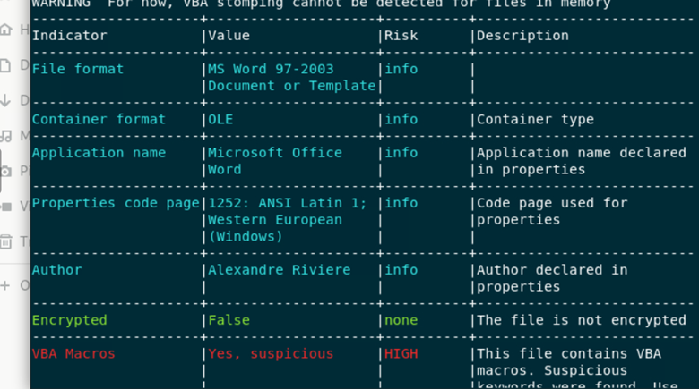
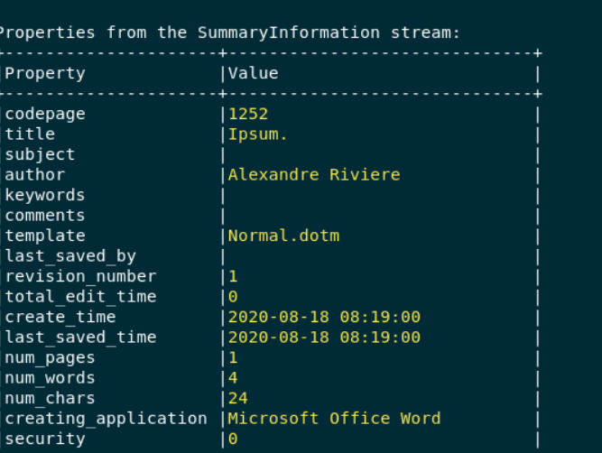
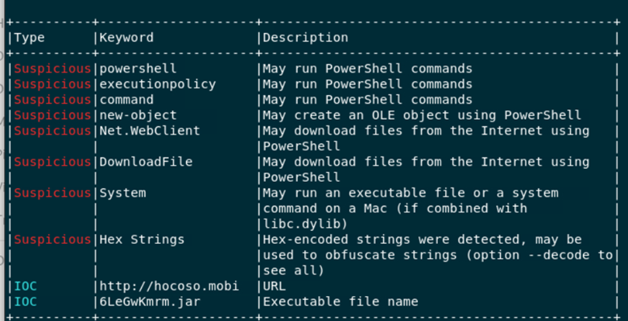
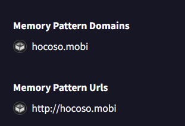

🎯 Purpose of This Analysis

The aim of this challenge was to statically analyze suspicious Microsoft Office docs without actually running them. The focus here was to:

Spot any embedded VBA macros that could execute malicious code.

Look for auto-execution triggers like Document_Open that attackers rely on to launch payloads.

Pull out and review metadata (author names, timestamps) that could help in attribution or timeline building.

Extract IOCs like URLs, domains, and hashes that tie back to the malicious activity.

Practice with forensic tools like exiftool, olevba, oleid, and olemeta that are used regularly in malware triage and IR.

This whole process simulates how you’d handle document malware in a real investigation. Instead of opening the file and risking an infection, static tools give you a safe way to pull evidence and get the bigger picture without executing anything harmful.

---

### 1️⃣ Does the file `/root/Desktop/QuestionFiles/PO-465514-180820.doc` contain a VBA macro?

**Method Used:**
```bash
exiftool PO-465514-180820.doc
```

**Observation:**
- The Template field shows `Normal.dotm`, which is macro-enabled.

**Screenshot:**  



**Answer:** ✅ Yes, the file contains a VBA macro.

---

### 2️⃣ Macro keyword enabling malicious activity

**Method Used:**
```bash
olevba PO-465514-180820.doc
```
Extracted macro code and looked for auto-execution keywords.

**Observation:**
- Found `Document_Open` in the first line — runs automatically when the document is opened.

**Answer:** 🔑 Macro Keyword: `Document_Open`

**Screenshot Proof:**  



---

### 3️⃣ Who is the author of the file?

**Method Used:**
```bash
oleid PO-465514-180820.doc
```
Retrieved metadata containing author information.


**Screenshot Proof:**  



---

### 4️⃣ Last saved time of the file

**Method Used:**
```bash
olemeta PO-465514-180820.doc
```
Displayed metadata including LastSavedTime.

**Answer:** ⏳ Last Saved Time: **(Timestamp from output)**

**Screenshot Proof:**  



---

### 5️⃣ Domain from which the malicious XLS file tries to download  
File: `/root/Desktop/QuestionFiles/Siparis_17.xls`

**Method Used:**
```bash
olevba --d Siparis_17.xls
```
Decoded macros to reveal any embedded URLs.

Verified findings by checking the file hash on VirusTotal.

**Observation:**
- Found IOC: `http://hocosco.mobi`
- VirusTotal confirmed similar domain activity.

**Answer:** 🌐 Domain: `hocosco.mobi`

**Screenshot Proof:**  




---

### 6️⃣ Number of IOCs in the XLS file according to olevba

**Method Used:**
```bash
olevba Siparis_17.xls
```
Checked the IOC extraction table in the output.

**Observation:**
- Detected **2 Indicators of Compromise**.

**Answer:** 📌 IOCs Count: **2**

**Screenshot Proof:**  


---

### 🛠 Tools Used
- **ExifTool** – Extracts file metadata.
- **Oletools Suite:**
  - **oleid** – High-level OLE document analysis.
  - **olemeta** – Extracts document metadata.
  - **olevba** – Extracts and analyzes VBA macros, IOCs, and auto-execution triggers.

---

### ⚠️ Disclaimer
All analysis was performed in a controlled, isolated lab environment.  
Never open suspicious files on your main system.
